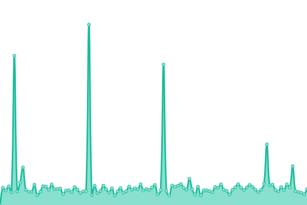
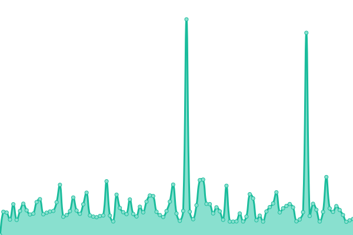
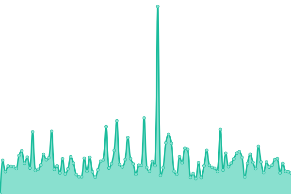
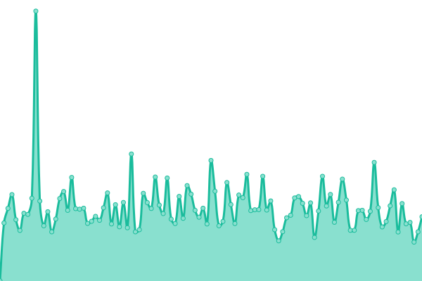

# [📈 Live Status](https://EducationalTools.github.io/status): <!--live status--> **🟩 All systems operational**

This repository contains the open-source uptime monitor and status page for [EduTools](https://educationaltools.github.io/), powered by [Upptime](https://github.com/upptime/upptime).

With [Upptime](https://upptime.js.org), you can get your own unlimited and free uptime monitor and status page, powered entirely by a GitHub repository. We use [Issues](https://github.com/EducationalTools/status/issues) as incident reports, [Actions](https://github.com/EducationalTools/status/actions) as uptime monitors, and [Pages](https://EducationalTools.github.io/status) for the status page.

<!--start: status pages-->
<!-- This summary is generated by Upptime (https://github.com/upptime/upptime) -->
<!-- Do not edit this manually, your changes will be overwritten -->
<!-- prettier-ignore -->
| URL | Status | History | Response Time | Uptime |
| --- | ------ | ------- | ------------- | ------ |
|  [github.io (Github Pages)](https://educationaltools.github.io/) | 🟩 Up | [github-io-github-pages.yml](https://github.com/EducationalTools/status/commits/HEAD/history/github-io-github-pages.yml) | 

 73ms
     
 | 

<a href="https://EducationalTools.github.io/status/history/github-io-github-pages">100.00%</a>
    

|  [pages.dev (Cloudflare Pages)](https://edutools.pages.dev/) | 🟩 Up | [pages-dev-cloudflare-pages.yml](https://github.com/EducationalTools/status/commits/HEAD/history/pages-dev-cloudflare-pages.yml) | 

 121ms
     
 | 

<a href="https://EducationalTools.github.io/status/history/pages-dev-cloudflare-pages">100.00%</a>
    

|  [ingo.au (Hostinger)](https://edutools.ingo.au/) | 🟩 Up | [ingo-au-hostinger.yml](https://github.com/EducationalTools/status/commits/HEAD/history/ingo-au-hostinger.yml) | 

 887ms
     
 | 

<a href="https://EducationalTools.github.io/status/history/ingo-au-hostinger">100.00%</a>
    

|  [ingowolf.au (Hostinger)](https://edutools.ingowolf.au/) | 🟩 Up | [ingowolf-au-hostinger.yml](https://github.com/EducationalTools/status/commits/HEAD/history/ingowolf-au-hostinger.yml) | 

 824ms
     
 | 

<a href="https://EducationalTools.github.io/status/history/ingowolf-au-hostinger">100.00%</a>
    

|  [surge.sh](https://edutools.surge.sh/) | 🟩 Up | [surge-sh.yml](https://github.com/EducationalTools/status/commits/HEAD/history/surge-sh.yml) | 

 641ms
     
 | 

<a href="https://EducationalTools.github.io/status/history/surge-sh">100.00%</a>
    

|  [infinityfreeapp.com (InfinityFree)](http://edutools.infinityfreeapp.com/) | 🟩 Up | [infinityfreeapp-com-infinity-free.yml](https://github.com/EducationalTools/status/commits/HEAD/history/infinityfreeapp-com-infinity-free.yml) | 

 316ms
     
 | 

<a href="https://EducationalTools.github.io/status/history/infinityfreeapp-com-infinity-free">100.00%</a>
    

|  [ct.ws (InfinityFree)](http://edutools.ct.ws/) | 🟩 Up | [ct-ws-infinity-free.yml](https://github.com/EducationalTools/status/commits/HEAD/history/ct-ws-infinity-free.yml) | 

 561ms
     
 | 

<a href="https://EducationalTools.github.io/status/history/ct-ws-infinity-free">100.00%</a>
    

|  [rf.gd (InfinityFree)](http://edutools.rf.gd/) | 🟩 Up | [rf-gd-infinity-free.yml](https://github.com/EducationalTools/status/commits/HEAD/history/rf-gd-infinity-free.yml) | 

 323ms
     
 | 

<a href="https://EducationalTools.github.io/status/history/rf-gd-infinity-free">100.00%</a>
    

|  [great-site.net (InfinityFree)](http://edutools.great-site.net/) | 🟩 Up | [great-site-net-infinity-free.yml](https://github.com/EducationalTools/status/commits/HEAD/history/great-site-net-infinity-free.yml) | 

 320ms
     
 | 

<a href="https://EducationalTools.github.io/status/history/great-site-net-infinity-free">100.00%</a>
    

|  [000.pe (InfinityFree)](http://edutools.000.pe/) | 🟩 Up | [000-pe-infinity-free.yml](https://github.com/EducationalTools/status/commits/HEAD/history/000-pe-infinity-free.yml) | 

 564ms
     
 | 

<a href="https://EducationalTools.github.io/status/history/000-pe-infinity-free">100.00%</a>
    

|  [free.nf (InfinityFree)](http://edutools.free.nf/) | 🟩 Up | [free-nf-infinity-free.yml](https://github.com/EducationalTools/status/commits/HEAD/history/free-nf-infinity-free.yml) | 

 376ms
     
 | 

<a href="https://EducationalTools.github.io/status/history/free-nf-infinity-free">100.00%</a>
    

|  [is-great.net (InfinityFree)](http://edutools.is-great.net/) | 🟩 Up | [is-great-net-infinity-free.yml](https://github.com/EducationalTools/status/commits/HEAD/history/is-great-net-infinity-free.yml) | 

 373ms
     
 | 

<a href="https://EducationalTools.github.io/status/history/is-great-net-infinity-free">100.00%</a>
    

|  [is-great.org (InfinityFree)](http://edutools.is-great.org/) | 🟩 Up | [is-great-org-infinity-free.yml](https://github.com/EducationalTools/status/commits/HEAD/history/is-great-org-infinity-free.yml) | 

 478ms
     
 | 

<a href="https://EducationalTools.github.io/status/history/is-great-org-infinity-free">100.00%</a>
    

|  [web.app (Firebase)](https://edutools-d915e.web.app/) | 🟩 Up | [web-app-firebase.yml](https://github.com/EducationalTools/status/commits/HEAD/history/web-app-firebase.yml) | 

 121ms
     
 | 

<a href="https://EducationalTools.github.io/status/history/web-app-firebase">100.00%</a>
    

|  [firebaseapp.com (Firebase)](https://edutools-d915e.firebaseapp.com/) | 🟩 Up | [firebaseapp-com-firebase.yml](https://github.com/EducationalTools/status/commits/HEAD/history/firebaseapp-com-firebase.yml) | 

 118ms
     
 | 

<a href="https://EducationalTools.github.io/status/history/firebaseapp-com-firebase">100.00%</a>
    

|  [onrender.com (Render)](https://educationaltools-github-io.onrender.com/) | 🟩 Up | [onrender-com-render.yml](https://github.com/EducationalTools/status/commits/HEAD/history/onrender-com-render.yml) | 

 254ms
     
 | 

<a href="https://EducationalTools.github.io/status/history/onrender-com-render">100.00%</a>
    

|  [vercel.app (Vercel)](https://educationaltools.vercel.app/) | 🟩 Up | [vercel-app-vercel.yml](https://github.com/EducationalTools/status/commits/HEAD/history/vercel-app-vercel.yml) | 

 237ms
     
 | 

<a href="https://EducationalTools.github.io/status/history/vercel-app-vercel">100.00%</a>
    

<!--end: status pages-->

[**Visit our status website →**](https://EducationalTools.github.io/status)

## 📄 License

- Powered by: [Upptime](https://github.com/upptime/upptime)
- Code: [MIT](./LICENSE) © [Anand Chowdhary](https://anandchowdhary.com), supported by [Pabio](https://pabio.com)
- Data in the `./history` directory: [Open Database License](https://opendatacommons.org/licenses/odbl/1-0/)
